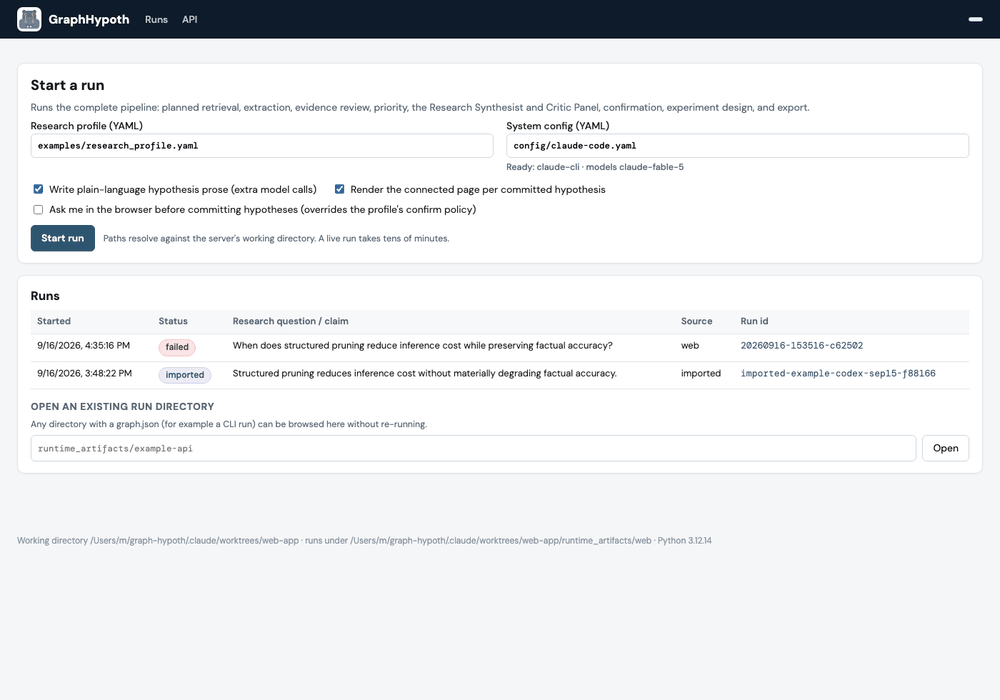
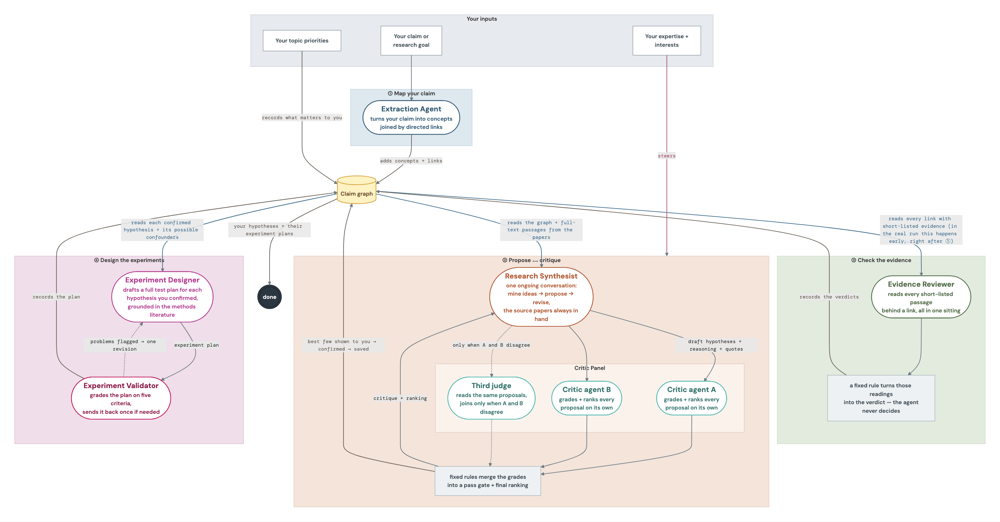
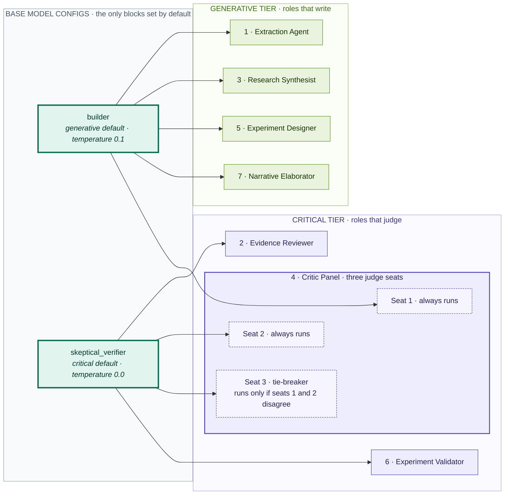

<p align="center">
  <picture>
    <source media="(prefers-color-scheme: dark)" srcset="docs/assets/logo/hypo-dark.svg">
    
  </picture>
</p>

<h1 align="center">GraphHypoth</h1>

GraphHypoth is a graph-harnessed hypothesis generation system. It turns a research
question and the literature around it into testable hypotheses and experiment plans.

It builds a **claim graph**: nodes are *concepts*, directed edges are the *relationships*
that retrieved sources assert between
them, and each edge carries the evidence retrieved for it and a verification
status. The graph and the deterministic code around it govern how those
relationships, and the hypotheses generated from them, are used in later
research stages. 

The graph is inspired by causal graphs (directed edges, confounders,
mediators), but the edges in the graph indicate the relationships that
a retrieved source asserts, not strictly causal relationships. We have
[discussion](#research-discussion) section talking about the implementation details.

<p align="center">
  
</p>
<p align="left"><em>An actual run with the <a href="#web-app-settings-2-and-3">web app</a>: the surfaced hypotheses, the claim graph, evidence quotes, an experiment plan. Normally a complete run lasts over one hour.</em></p>

## What A Complete Run Does

A complete run involves 8 pipeline stages as follows.

| Step | Stage | Description |
| --- | --- | --- |
| 1 | **Extraction** | The **Extraction Agent** turns the seed claim or research goal into concept nodes and directed edges. Every edge starts `unverified`. |
| 2 | **Retrieval** | Literature is retrieved for the claim at the start of the run. A deterministic scorer short-lists the most relevant passages for each edge. |
| 3 | **Evidence evaluation** | The **Evidence Reviewer** grades each short-listed passage for one edge. The deterministic code fuses the grades into a status and confidence and records them on the edge. |
| 4 | **Priority** | The researcher's weighted topics (configured before the run) from the profile are recorded on matching nodes, and steer which surfaced hypotheses are listed first. They never change a status or confidence. |
| 5 | **Hypothesis development** | The **Research Synthesist**, in one persistent thread, mines new concepts from the passages, proposes candidate hypotheses over the committed graph, and revises them after a **Critic Panel** review. Deterministic gates then filter the candidates and rank the survivors. |
| 6 | **Confirmation and commit** | The top-ranked candidates are shown to the researcher, or resolved by the profile's confirmation policy. Only confirmed candidates are committed, as new `unverified` edges, and only those whose commit succeeds move on. |
| 7 | **Experiment design** | For each committed hypothesis the **Experiment Designer** drafts a plan grounded in a targeted methods retrieval and the graph's confounder and mediator nodes; the **Experiment Validator** grades it on five criteria with one revision round by default. A content-complete plan is committed against the hypothesis edge. |
| 8 | **Export** | The graph, an edge table, an audit memo, one trace page per surfaced hypothesis, one standalone connected page per *committed* hypothesis, and a provenance database. |


Edge statuses are `unverified`, `supported`, `contradicted`,
`qualified`, `not_causal`, and `insufficient`. The current default configuration
only the `support` evidence role is scheduled, so an edge commits as
`supported` or `insufficient`; a computed contradiction, qualification, or
`not_causal` verdict is recorded as an open risk and the edge stays
`unverified`. Hypothesis edges are not evidence-reviewed; their grounding comes
from the experiment stage.

The following diagram shows how the agents interact with each other.

<p align="center">
  <a href="docs/assets/pipeline-plain-words.png"></a>
</p>

There is also a [complete pipeline diagram](docs/assets/pipeline-complete.png) showing every
agent role, gate, and transaction during a complete run.

## Commands

The package installs three console scripts.

| Command | What it runs | Builds the claim graph? |
| --- | --- | --- |
| `graph-hypoth-synthesist --profile <yaml>` | The complete pipeline above: planned retrieval, extraction, evidence review, priority, Synthesist and Critic Panel, confirmation, experiment design, export, trace and hypothesis pages | Yes |
| `graph-hypoth-orchestrate --claim "..."` | Extraction, retrieval, evidence review, priority, and export only. No Synthesist, panel, or experiment stage is wired, and the run records that as an open risk | Yes, evidence core only |
| `graph-hypoth-web` | A local web app around the complete pipeline: start a run from a profile, follow its progress, confirm hypotheses in the browser, and browse every run's claim graph and pages ([guide](docs/guides/web-app.md)) | Yes, through the `graph-hypoth-synthesist` driver |

## Quick Start

Choose who controls the workflow and how models and search are accessed:

| Setting | Workflow control                                                              | Model and search access                                       | Tradeoff                                                                                                                                            |
| --- |-------------------------------------------------------------------------------|---------------------------------------------------------------|-----------------------------------------------------------------------------------------------------------------------------------------------------|
| **1. Pure coding agent** | Your coding agent dominates the whole workflow.                               | Saved Claude Code or Codex login, and their native web search | Least setup efforts; procedural checks depend on the harness of your agents.                                                                        |
| **2. Python + coding-agent CLI** | GraphHypoth's Python pipeline calls CLI processes for reasoning and retrieval | Saved Claude Code or Codex login, and their native web search          | Enforced stages, graph validation, and audit receipts without separate model/search API keys; requires Python setup and incurs subprocess overhead. |
| **3. Python + APIs** | The same Python pipeline calls model and retrieval APIs                       | OpenRouter and retrieval-service credentials                  | Much wider provider choices (e.g. choosing models outside Anthropic and OpenAI); requires additional API keys and separate service billing.         |

Start with setting 1 for interactive exploration. Use setting 2 or 3 when you
need the implemented pipeline described above, including its deterministic
scoring, graph commits, and standard exports. Generated results can vary in
all three settings.

### Non-Python Setup
#### Setting 1: Throw this repo to your coding agent

<details>
<summary>
Suggested prompt (replacing the research question and priorities)
</summary>

```text
Use GraphHypoth's research stages to investigate:
Question: [your research question]
Priorities: [your field, constraints, and desired outcomes]

Read this README, the pipeline diagram and the codebase. Carry out
the research directly in this agent session,
using your own reasoning and native web search/fetch tools. 

Extract concepts and source-asserted relationships, retrieve and assess
evidence, then propose hypotheses. Perform a separate critic pass (using
reviewer subagents if available), revise the hypotheses, and draft testable
experiment plans for the strongest candidates. Distinguish source claims,
your inferences, and untested hypotheses; preserve source URLs and flag gaps.

Save a research report, evidence table, draft relationship graph, hypotheses,
and experiment plans under `runtime_artifacts/example-agent/`. Label them as
agent-authored exploratory outputs and record any skipped stages or checks.
Leave the repository implementation unchanged.
```
</details>


The resulting reports and graph are authored by *your coding agent*. 
Alternatively, you can ask your coding agents to *launch subagents as LLM live calls*.

The Python pipeline's
validation gates, scoring rules, receipt log, and export format are only available
when the exact python code is executed. 
However, letting your coding agents follow the prompt does not provide these certainly (it depends the exact harness of your coding agents). 


### Python setup (settings 2 and 3)

From the repo root, create an environment with Python 3.11 or newer. Name that
interpreter explicitly — a bare `python` may be absent or older than 3.11:

```bash
python3.12 -m venv .venv          # any 3.11+ interpreter
source .venv/bin/activate
python -m pip install -U pip
python -m pip install -e ".[all]"
```

The `all` extra includes the retrieval, retrieval-coherence, and development
dependencies. The current default retrieval coherence downloads the pinned
[`allenai/specter2_base`](https://huggingface.co/allenai/specter2_base) model
(approximately 870 MB) into the Hugging Face cache;
it is not bundled with this repository and requires extra downloading. 

If that model cannot be loaded, most
embedding-based scoring falls back to lexical similarity, but extraction can fail
when it produces concept-merge candidates, so production runs should cache the
model in advance. 

The standalone [example script](scripts/run_example.py) runs the complete pipeline. Both settings below use the same example research profile;
choose one backend configuration before running it.

#### Setting 2: Python workflow + coding-agent CLI

Install and sign in to Claude Code or Codex using the links in setting 1.
Python controls the stages and launches a fresh CLI process for each workflow
model call or web-retrieval query. The child processes reuse the CLI's saved
login; the supplied configurations need no separate model or search API keys.

Choose [config/claude-code.yaml](config/claude-code.yaml) for `claude-cli` workflow
calls and `claude_web` retrieval, or [config/codex.yaml](config/codex.yaml) for
`codex-cli` and `codex_web`. Set the model IDs to models your saved login can use.
For example, with Claude Code:

```bash
mkdir -p runtime_artifacts
cp config/claude-code.yaml runtime_artifacts/config-claude-code.yaml
vim runtime_artifacts/config-claude-code.yaml
python scripts/run_example.py \
  --config runtime_artifacts/config-claude-code.yaml \
  --run-dir runtime_artifacts/example-coding-agent
```

For Codex, copy `config/codex.yaml` instead and pass that copy with `--config`.

Alternatively, if you are able to use both `claude-cli` and `codex-cli`, you may
want to try [a mixed vender configuration](config/mixed-vendor-cli.yaml), e.g. 
for better Critic Panel setting, such that the panel is not one model voting three times.
See the [CLI backend guide](docs/guides/cli-subagent-backends.md) for process
isolation, supported options, and limitations.

<!-- Runs show live progress on stderr: pipeline stages, retrieval attempts, evidence
links, critic rounds, and experiment counts. During a silent operation, a heartbeat
every 30 seconds shows the active work and elapsed time. Add `--quiet` to suppress
progress, or `--progress-jsonl runtime_artifacts/progress.jsonl` to save structured
events as well. These options work with `scripts/run_example.py` and both CLI
commands, for settings 2 and 3. -->

#### Setting 3: Python workflow + APIs

[config/api.yaml](config/api.yaml) uses [OpenRouter](https://openrouter.ai/) for all workflow LLM calls,
and [arXiv](https://arxiv.org/), [Exa](https://exa.ai/), [Crossref](https://www.crossref.org/),
[OpenAlex](https://openalex.org/), and [Europe PMC](https://europepmc.org/) for retrieval. Replace
the two `<VENDOR>/<MODEL_ID>` placeholders with OpenRouter catalog slugs, then
export the required credentials. `OPENROUTER_API_KEY` and `EXA_API_KEY` are both mandatory;
`OPENALEX_API_KEY` is optional (OpenAlex works keyless, the key only raises the quota).

```bash
mkdir -p runtime_artifacts
cp config/api.yaml runtime_artifacts/config-api.yaml
vim runtime_artifacts/config-api.yaml   # Remember to choose your preferred models in OpenRouter
export OPENROUTER_API_KEY='...'
export EXA_API_KEY='...'
python scripts/run_example.py \
  --config runtime_artifacts/config-api.yaml \
  --run-dir runtime_artifacts/example-api
```

### Inputs and Outputs (Settings 2 and 3)

The script defaults to `examples/research_profile.yaml` and writes the graph,
edge table, audit memo, connected hypothesis pages, `trace/`, and `events.sqlite`
under the run directory. Pass `--profile <yaml>` to use your own profile, or
`--no-elaborate` to skip the default plain-language hypothesis prose and its extra model calls. Run
`python scripts/run_example.py --help` to inspect its options without calling
any providers. The underlying `graph-hypoth-synthesist` command remains available
for setting individual output paths and other advanced options.

Static example trace pages rendered from the same profile are checked in at
[examples/html/research-profile-trace/index.html](examples/html/research-profile-trace/index.html).
They demonstrate the HTML layout without requiring live model or retrieval
credentials.

<details>
<summary>Profile customization and preflight details</summary>

The [profile](examples/research_profile.yaml) carries the research question (or claim/goal), field,
expertise, weighted `concepts` with the `priority_author` who authored them, the
number of Critic Panel judges, the number of experiment refinement rounds, and
the `confirm` policy (`interactive`, `all`, `top_k`, or `threshold`). Weighted
`concepts` and `priority_author` travel together: the concepts build a priority
annotation whose author may not be empty, so a profile with concepts and no
author is rejected before retrieval starts. Copy the profile to an untracked
file to describe your own question. In the copy, set `reader_lexicon` to
`examples/reader-lexicons/example.yaml` or remove the key: a relative value
resolves against the profile file and then the working directory. The lexicon
takes effect when prose generation is enabled (the default for trace reports);
`--no-elaborate` skips both prose generation and reader translation; see the [reader lexicon procedure](docs/pipelines/user-lexicon.md).

Both commands preflight model credentials and the required retrieval sources
before running. `graph-hypoth-orchestrate` checks the two base model
configurations; `graph-hypoth-synthesist` checks every role its run will use,
including the prose writer and any reader-lexicon roles unless `--no-elaborate` is set. The check
reads each role's `api_key_env`, so a `claude-cli` or `codex-cli` role — which
has none — is never exercised at preflight, and a `model_id` that login cannot
use surfaces only when that role is first called. A live run takes far longer
than the model calls alone suggest: claim-level retrieval fans the planner's
sub-queries out across the sources and fetches full text for each hit, so budget
tens of minutes, not five. Setup details,
key-file loading, and every credential the code reads are in
[local setup and API key loading](docs/guides/local-setup-and-key-loading.md).

</details>

### Web app (accompany with settings 2 and 3)

`graph-hypoth-web` wraps the same driver in a local web app, so the two moments
that need a person, following a run that takes tens of minutes and choosing
which hypotheses to commit, happen in the browser instead of a terminal.
Install the `web` extra (included in `all`) and start the server from the
repository root:

```bash
python -m pip install -e ".[web]"
graph-hypoth-web
```

It opens `http://127.0.0.1:8765/`. From there you start a run from a profile
and config (pick `config/claude-code.yaml` or `config/codex.yaml`, or your own
copy with real model ids.

<!-- The current `evidence-evaluation.yaml` is a template
and the app refuses its placeholders before starting), watch the stage
progress, answer the confirmation step when the
profile's policy is `interactive` (or when you tick *ask me in the browser*),
and, once the run finishes, open the trace and connected pages and inspect the
claim graph on an interactive canvas: click an edge for its status, verdict,
evidence quotes, and experiment plan. 

Runs are saved under
`runtime_artifacts/web/<run-id>/` with the same artifacts as a CLI run plus
`progress.jsonl` and `web_run.json`; an existing run directory can also be
opened without re-running. The server runs one pipeline at a time and binds to
the loopback address.  -->

See the [web app guide](docs/guides/web-app.md) for more details.

## Artifacts of a Single Run

A Python pipeline run (setting 2 or 3) with both `--export-dir` and `--trace-dir`
set writes:

```bash
<run-dir>/<candidate_id>-connected.html   # one page per committed hypothesis
<run-dir>/trace/index.html                # surfaced ranking index
<run-dir>/trace/<candidate_id>.html       # one page per surfaced hypothesis
<run-dir>/trace/plain_language.json       # per-hypothesis audits, plans, attempts
<run-dir>/graph.json                      # the claim graph store
<run-dir>/edge_table.csv                  # one row per edge
<run-dir>/audit_memo.md                   # edge statuses, open risks, receipts
```

<details>
<summary>Artifacts details</summary>
The two hypothesis page sets do not have the same membership. Every surfaced
hypothesis gets a trace page. In a current run, a connected page requires the
candidate's exact committed-edge binding from `plain_language.json`; the
renderer treats that mapping as authoritative and skips an unconfirmed
candidate even if the same focus node exists for another reason. Older
sidecars without the mapping fall back to exact focus-node adjacency. Thus the
example profile's `top_k: 2` yields five trace pages and two connected pages,
and the renderer names each unconfirmed candidate it passed over.

Each connected page carries the hypothesis's connected component, its ranking
scores, per-concept source provenance, and, when one was committed, the
experiment plan with its evidence traceback; it is rendered from the run's own
artifacts with no model calls. The driver generates a plain-language summary
before rendering by default; `--no-elaborate` skips it. If a summary is missing,
the page says so instead of displaying the technical experiment specification as a headline. `--no-connected-render` skips those pages.

The example profile starts with `research_question`, an open question such as
“When does structured pruning reduce inference cost while preserving factual accuracy?”
Choose one starting input: `research_question`, `claim`, or `research_goal`.
The broader `interest` field remains separate. Existing claim and goal profiles still work.

Reports show **Research question** first, then **Proposed hypothesis**, then
**How this hypothesis addresses the question**. A claim input is labeled
**Claim to investigate**; a goal remains **Research goal**. Relationship explanations
are saved as `relationship_to_seed` in the reader cards for offline rendering; older
cards without that field omit the section. The question's type also steers retrieval,
mining, and proposal prompts so the desired outcome is not treated as established.

`edge_table.csv` has a `status` column and a `verdict` column. The verdict is
what the deterministic fusion selected, and it is recorded even when the commit
was withheld, so a row can read `status=unverified` beside a non-empty verdict.
Every command also writes an events database (`*.sqlite`) holding audit events,
the retrieval cache, and per-source attempts; a rerun with the same run id
replays cached retrieval instead of calling sources. Set
`GRAPH_HYPOTH_RUNTIME_LOG_DIR` to record a runtime trace, then render it with
`python scripts/render_runtime_logs.py --root runtime_logs`. Traces and export
directories can contain prompts, provider responses, retrieved text, and local
paths. Treat them as private until reviewed.
</details>

## Configuration Details

The default configuration is
[config/evidence-evaluation.yaml](config/evidence-evaluation.yaml). Copy it to
an untracked file and pass the copy with `--config`.

### Agent Roles

The pipeline has seven workflow roles: **Extraction Agent**, **Evidence Reviewer**,
**Research Synthesist**, **Critic Panel**, **Experiment Designer**, **Experiment Validator**,
and the **Narrative Elaborator** (runs for trace reports unless `--no-elaborate` is set).
See a [pipeline illustration](docs/architecture-design/overview/simplified-pipeline-digram.html)
for how these roles collaborate with each other.

<details>
<summary>Base Model Configs</summary>

They draw
their models from two base model configurations, which are configuration
blocks rather than agents:

- `builder` is the generative default: Extraction Agent, Research Synthesist,
  Experiment Designer, Narrative Elaborator, and the retrieval planner and
  reader translator seams.
- `skeptical_verifier` is the critical default: Evidence Reviewer, Experiment
  Validator, and the translation verifier seam.

Any role can be given its own block (`evidence_reviewer`,
`research_synthesist`, `critic_panel`, `experiment_designer`,
`experiment_validator`, `elaboration_writer`, `reader_translator`,
`translation_verifier`) and otherwise inherits its tier default. The diagram
below is a verbatim copy of
[agent-role-relationship.mmd](docs/architecture-design/overview/agent-role-relationship.mmd),
the source of truth; a test keeps the two in sync.
</details>

<details>
<summary>Temperature for output diversity</summary>

The `temperature` value in each block sets how much the output may vary between
runs. `skeptical_verifier` uses 0.0, so the judging roles give the same answer to
the same input every time; `builder` uses 0.1, so the writing roles may differ a
little from run to run. This setting only takes effect with the `openrouter`
provider. The `claude-cli` and `codex-cli` providers ignore it.
</details>


The choice for each agent role is based on the required model capacity for each role,
and some less capable agents could be afforded by resource-constraint devices (e.g. personal laptops).
We have a detailed discussion about this in
[which models can go local](docs/research/which-agents-go-local.md).

### Local CLI Backends and Live-web Sources

`claude-cli` and `codex-cli` run one constrained local CLI process per model
call. Two
matching opt-in retrieval sources, `claude_web` and `codex_web`, are the only
subprocesses allowed to search the web. Configuration, isolation boundaries,
and limits are in
[local CLI subagent backends and live-web sources](docs/guides/cli-subagent-backends.md).

### Retrieval

See [retrieval](docs/guides/paper_retrieval.md) for the detailed retrieval configuration.

## Cost Measurement

Per-call figures are recorded in audit events: the Claude CLI backend logs a
CLI-reported `total_cost_usd`, and token usage is captured where a provider
reports it. Neither is aggregated into a run total, and there is no cost budget
and no billing reconciliation — `cost_tracking`, the `--reconcile-openrouter`
flag, and the OpenRouter reconciler belonged to the removed debate path and went
with it. Measuring a run's dollar cost means reading the audit events, or the
provider's own billing.

## Documentation

### System Architecture Design and Feature Configuration Guides
- [Pipeline diagram](docs/architecture-design/overview/simplified-pipeline-digram.html):
  the complete pipeline and a plain-words version.
- Feature Configuration Guides
  - [local setup, keys, and development checks](docs/guides/local-setup-and-key-loading.md)
  - [model configuration and scoring defaults](docs/guides/model-configuration.md)
  - [paper retrieval](docs/guides/paper_retrieval.md)
  - [local CLI backends](docs/guides/cli-subagent-backends.md)
  - [reader lexicon procedure](docs/pipelines/user-lexicon.md)

### Research Discussion

Four reports in [docs/research](docs/research/README.md) review the system
from complementary angles. Each has a short hype version beside it (*-decision.md).

- [Claims Before Causes](docs/research/claims-before-causes.md): why the current
  pipeline stores the relationships that sources assert as a claim graph
  rather than as a causal model?
- [From Traceable Claims to Testable Hypotheses](docs/research/traceable-claims-to-testable-hypotheses.md):
  what the current implementation contributes to scientific reasoning?

- [Which Agents Go Local?](docs/research/which-agents-go-local.md): running agents locally might be the most effective way to boost productivity with AI, and avoiding the dramatic loss from cyberattacks at the same time. However, which stages can be handed off to local agents?
- [Retrieval for Local Agents](docs/research/retrieval-for-local-agents.md):
  what retrieval substitutes for storing knowledge and what still needs an
  AI agent to read evidence and come up with a judgment?

